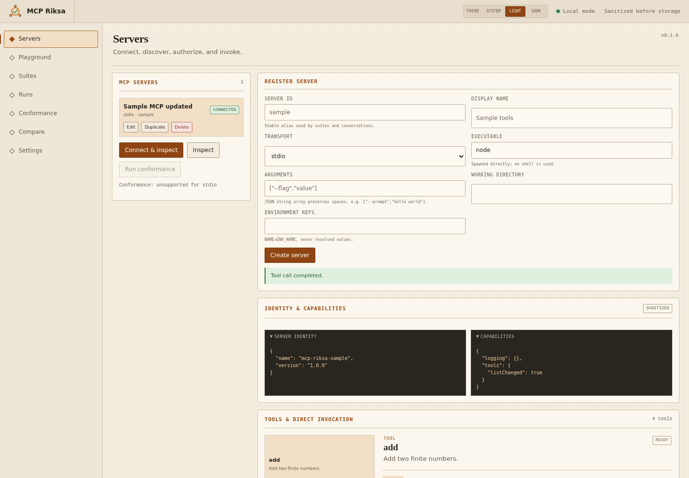
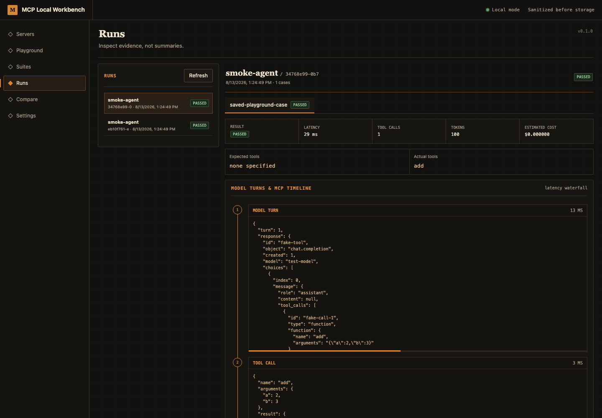

# MCP Local Workbench

MCP Local Workbench runs MCP server and agent evaluations on your machine. It connects to stdio or Streamable HTTP servers, drives OpenAI-compatible and Anthropic-compatible model endpoints, stores sanitized run history in SQLite, and executes the same YAML suites from the browser or CLI.

The service binds to `127.0.0.1` on port `4317`. It has no login, cloud sync, telemetry, external fonts, or CDN assets.

## Requirements

- Node.js 24
- npm 11 or newer
- A C/C++ build toolchain if npm needs to compile `better-sqlite3`
- Google Chrome for the automated browser test

## Start the browser workbench

```bash
npm install
npm run dev -- --config examples/workbench.config.yaml
```

Open `http://127.0.0.1:4317`. The header appearance control offers light, dark, and system themes. First visits follow the operating-system setting; explicit choices persist in browser-local storage.

The example config registers the deterministic stdio server and a provider alias. Start the bundled fake provider in a second terminal before running an agent case:

```bash
export WORKBENCH_PROVIDER_API_KEY=local-test-only
npx tsx scripts/fake-provider.ts --port 4000
```

The API key stays in the process environment. The config stores `WORKBENCH_PROVIDER_API_KEY`, which is the environment variable name.

## Browser tour

### Connect and invoke a simple stdio MCP server

The bundled sample server is a real MCP process started directly over stdio—no shell and no remote service. The workbench discovers its identity, capabilities, and three tools, then invokes `add` with `{"a":2,"b":3}`:



### Compose portable test suites

The Suites workspace provides a visual case composer for direct tool calls and agent scenarios. Add expected tool calls, output assertions, JSONPath checks, and duration/token/cost budgets without hand-authoring every YAML field. The YAML tab remains canonical: visual edits serialize to strict version 1 YAML that can be committed and run unchanged through the CLI or CI.

Existing suite files load back into the visual composer, while raw YAML remains editable for advanced cases. Suite library supports full CRUD: create, load/edit, rename, duplicate, and delete. Renaming moves the YAML artifact; deleting removes only suite definition and preserves historical run evidence.

### Inspect a completed agent evaluation

The browser and CLI use the same YAML suite runner. This completed example records the provider turn, MCP tool call, latency, tokens, estimated cost, assertions, and sanitized timeline:



Build and serve the production bundle with:

```bash
npm run build
npm start -- --config examples/workbench.config.yaml
```

## Headless CLI

Inspect the real sample server:

```bash
npx tsx src/cli/index.ts inspect --sample --json
```

Run the direct-tool sample and write all three report formats:

```bash
npx tsx src/cli/index.ts run examples/sample-suite.yaml \
  --config examples/workbench.config.yaml \
  --data-dir .workbench/cli \
  --output reports
```

Run the provider-to-tool agent sample after starting `scripts/fake-provider.ts`:

```bash
export WORKBENCH_PROVIDER_API_KEY=local-test-only
npx tsx src/cli/index.ts run examples/sample-agent-suite.yaml \
  --config examples/workbench.config.yaml \
  --data-dir .workbench/agent-cli \
  --output agent-reports
```

The CLI writes `run.json`, `run.html`, and `junit.xml`. It prints JSON to stdout and returns a nonzero exit code when the suite fails.

## Configuration

`examples/workbench.config.yaml` shows the complete file shape. Provider configs support:

- `openai-compatible` and `anthropic-compatible` protocols
- multiple model aliases per provider, each mapped to its upstream model ID
- API key and custom header environment references
- local input and output prices per million tokens
- OpenAI-compatible model discovery and connection testing
- create, edit, duplicate, and reference-safe delete workflows for providers and MCP servers

Each provider owns a model catalog, so one endpoint and credential set can expose aliases such as `fast`, `quality`, and `reasoning`. Editing keeps the provider ID stable; duplicating creates a new ID. Removing model aliases is blocked while saved suites or conversations still reference them.

Browser edits persist in SQLite. Configuration passed to `serve --config` seeds missing entries without overwriting browser edits; deleting a seeded entry creates a local tombstone so it stays deleted across restarts. Headless `run --config` remains authoritative and applies its configuration for that run.

Streamable HTTP servers may add interactive OAuth settings. Authorization Code + PKCE, metadata discovery, DCR when advertised, and pre-registered clients are included in the MVP:

```yaml
oauth:
  scopes: [mcp:read, mcp:write]
  timeoutMs: 120000
  # Omit clientId for DCR when the authorization server advertises it.
  clientId: pre-registered-client
  clientSecretEnv: MCP_OAUTH_CLIENT_SECRET
```

The workbench discovers RFC 9728 protected-resource metadata and RFC 8414 authorization-server metadata. It uses the MCP SDK OAuth provider interface for DCR, Authorization Code + PKCE, token exchange, refresh, and invalidation. `oauth4webapi` supplies standards-based random OAuth state. The callback accepts loopback HTTP URLs and checks state before code exchange.

Interactive authorization opens in a popup. Successful callbacks notify the opener through a same-origin channel, close the popup, refresh authorization status, and reconnect the MCP server automatically. A bounded status poll covers browsers that suppress popup messaging.

OAuth tokens, authorization codes, PKCE verifiers, and client secrets remain in memory. “Forget authorization” clears them. A process restart requires authorization again. CI can use client credentials outside the interactive UI or inject a short-lived bearer token through a header environment reference.

## Playground conversations

Playground sends provider output over a local SSE stream. OpenAI-compatible and Anthropic-compatible adapters emit text deltas while model turns and MCP tool calls continue through the same normalized agent loop used by suites. Suite execution stays non-streaming for deterministic assertions.

New conversations start with an empty composer—no sample request is injected. An optional system prompt is fixed when the conversation is created and shown in the Model Context inspector. Raw view exposes a sanitized model-context preview: system prompt, prior chat messages, pending user turn, MCP tool source, and execution limits. Provider adapters may encode that context differently on wire—for example, Anthropic uses a top-level `system` field.

Playground left rail switches between **Tools** and **Sessions**. Tools tab discovers selected server’s tools, shows descriptions and input schemas, generates typed parameter forms, and supports raw JSON. **Run Tool** performs a direct invocation and writes a truthful `Execute <tool>` user turn plus sanitized result into chat history; destructive tools still require explicit confirmation.

Conversations and sanitized message traces persist in local SQLite. Conversation history survives browser and workbench restarts and includes input/output tokens, cumulative cost, agent time, tool calls, stop reason, and immutable normalized trace events. **Chat**, **Trace**, and **Raw** views provide rendered Markdown, an observability-style latency waterfall with expandable span data, and the complete sanitized record. Use **Save YAML case** to turn any completed turn into a portable regression case.

Assistant Markdown supports headings, emphasis, lists, tables, links, blockquotes, and fenced code without executing raw HTML. MCP tool results render text, inline image, resource-link, embedded-resource, and structured-content blocks while retaining raw JSON inspection.

Direct tool invocation uses each tool's JSON Schema to generate typed fields for required/optional strings, numbers, booleans, enums, nested objects, and arrays. Raw JSON remains available as an advanced fallback.

## Suite format

Suites use strict versioned YAML. Unknown keys, malformed calls, invalid budgets, and inline secret fields fail parsing. Direct cases invoke a named tool. Agent cases reference server, provider, and model aliases.

Supported assertions cover tool called or not called, count, order, arguments, JSONPath, contains, regex, duration, total tokens, and estimated cost. See [sample-suite.yaml](examples/sample-suite.yaml) and [sample-agent-suite.yaml](examples/sample-agent-suite.yaml).

## Security boundaries

- Express binds to `127.0.0.1` unless you pass both a non-loopback `--host` and `--allow-external`.
- The API still rejects non-loopback clients and external-origin mutations. External bind does not grant remote control.
- Each process creates a random browser session token. Mutations require that token and a loopback `Origin`.
- MCP and model endpoints accept HTTP or HTTPS. The runtime blocks URL credentials, link-local targets, and common cloud metadata hosts.
- Stdio spawns an executable with an argument array and no shell.
- Tool definitions marked destructive require explicit confirmation for manual calls.
- The runtime redacts authorization headers, cookies, token fields, URL query secrets, bearer strings, and nested payloads before SQLite writes, API output, logs, or reports.
- SQLite uses WAL, forward migrations, transactional completion, interrupted-run recovery, immutable run/playground event rows, configuration deletion tombstones, and sanitized local playground history.

## Verification

Run the same checks used in CI:

```bash
npm test
npm run typecheck
npm run build
node dist/src/cli/index.js run examples/sample-suite.yaml \
  --config examples/ci-workbench.config.yaml \
  --data-dir .workbench/ci \
  --output reports
```

`npm test` includes real stdio and Streamable HTTP MCP discovery/invocation, streamed and non-streamed fake OpenAI-compatible and Anthropic-compatible agent loops, durable conversations, OAuth callback handoff, API security, SQLite transactions, reporters, CLI subprocesses, and the Chrome desktop/mobile journey. GitHub Actions uploads the CLI reports.

The deterministic fake OpenAI-compatible endpoint exercises a standard `/v1/chat/completions` tool-call contract without requiring any particular gateway product or external credentials during tests.

## Current limitations

- OAuth material uses memory-only storage. Encrypted token persistence is not part of this release.
- Anthropic-compatible endpoints do not expose a standard model-list route, so their connection test sends a short completion request.
- JSONPath assertions support property access, array indexes, and quoted bracket keys. Filter expressions and scripts are excluded.
- Cost uses the local prices in provider config. A provider response without usage reports zero tokens and zero estimated cost.
- The app owns and stops stdio children. It does not stop external HTTP servers.
