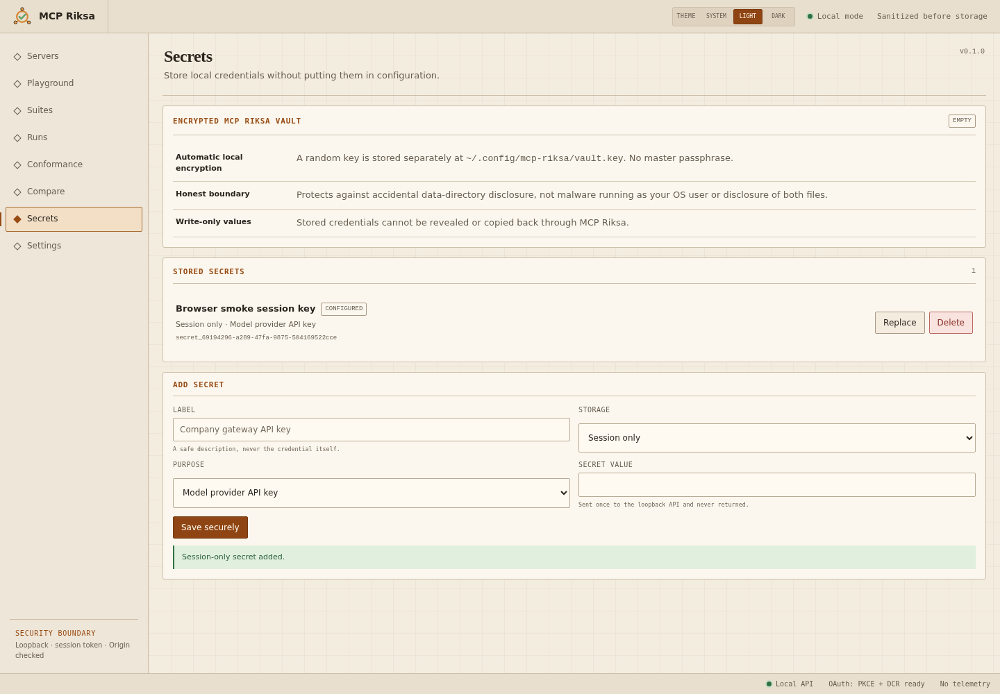

# MCP Riksa

[](https://www.npmjs.com/package/mcp-riksa)

MCP Riksa is a local-first workbench for testing MCP servers and agents. It connects to stdio or Streamable HTTP MCP servers, drives OpenAI-compatible and Anthropic-compatible model endpoints, stores sanitized run history in SQLite, and runs the same YAML suites from the browser or CLI so you can commit a suite once and run it identically in CI.

It binds to `127.0.0.1` by default and has no login, cloud sync, telemetry, external fonts, or CDN assets.

## Install

```bash
npm install -g mcp-riksa
mcp-riksa serve --config ./mcp-riksa.config.yaml
```

Or run it without installing:

```bash
npx mcp-riksa serve --config ./mcp-riksa.config.yaml
```

Open `http://127.0.0.1:4317`. By default, runtime state is stored in `.mcp-riksa` relative to current directory. Set `MCP_RIKSA_DATA_HOME` or pass `--data-dir` for a personal shared workbench; see [Headless CLI](docs/CLI.md#runtime-data-directory).

## Try it against the bundled sample

```bash
git clone https://github.com/irfansofyana/mcp-riksa.git
cd mcp-riksa
npm install
npm run dev -- --config examples/mcp-riksa.config.yaml
```

The example config registers a deterministic stdio MCP server and a provider alias. To run an agent case against it, start the bundled fake provider in a second terminal:

```bash
export MCP_RIKSA_PROVIDER_API_KEY=local-test-only
npx tsx scripts/fake-provider.ts --port 4000
```

The API key stays in the process environment — the config only ever stores `{ source: env, name: MCP_RIKSA_PROVIDER_API_KEY }`, never the value itself.

## What it does

**Connect and invoke a real MCP server.** The bundled sample server runs as a real MCP process over stdio — no shell, no remote service. The workbench discovers its identity, capabilities, and tools, then invokes them with generated forms.


**Store credentials without touching environment variables.** The Secrets workspace accepts write-only credentials into an encrypted local vault or session memory — the browser and API only ever see opaque references, never raw values.



**Compose portable test suites visually.** Add tool-call expectations, assertions, and cost/duration budgets through a case composer, hand-author the underlying YAML, or use a configured model to generate a reviewable agent-suite draft from live MCP tool metadata. Draft generation never invokes tools, saves files, or starts runs.

**Inspect a completed evaluation.** The browser and CLI share the same suite runner, so a run's trace — provider turns, MCP tool calls, latency, tokens, estimated cost, assertions — looks identical whether it ran interactively or headless.


## Documentation

- [Configuration](docs/CONFIGURATION.md) — providers, secrets, OAuth, static auth
- [Suite format](docs/SUITES.md) — assertions, direct vs. agent cases, the visual composer
- [Playground](docs/PLAYGROUND.md) — the interactive chat/tool-call workspace
- [Headless CLI](docs/CLI.md) — running suites outside the browser, CI usage
- [Security boundaries](docs/SECURITY.md) — what MCP Riksa protects against, and what it doesn't
- [Development](docs/DEVELOPMENT.md) — local setup, verification, releasing to npm

## License

[MIT](LICENSE)
